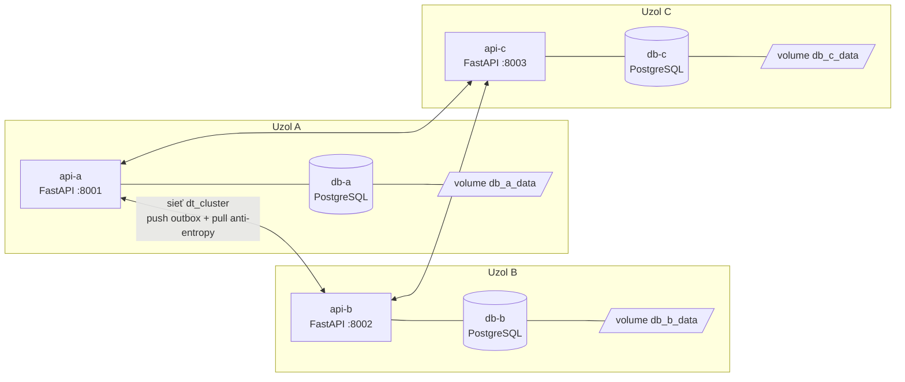

# Kontajnerizovaný distribuovaný informačný systém

Projekt z predmetu **Distribuované technológie 1 – Variant 2: Kontajnerizovaný distribuovaný IS**.

Systém tvoria tri rovnocenné uzly **A, B, C**. Každý uzol má vlastný kontajner REST API (FastAPI),
vlastný databázový kontajner (PostgreSQL) a vlastný persistentný volume. Uzly sa navzájom replikujú,
pri výpadku siete pracujú ďalej lokálne, neodoslané operácie trvalo evidujú a po obnovení spojenia sa
automaticky (alebo ručne) zosynchronizujú – bez duplicít a s deterministickým riešením konfliktov.

---

## Obsah

1. [Architektúra](#1-architektúra)
2. [Dátový model](#2-dátový-model)
3. [Replikácia a synchronizácia](#3-replikácia-a-synchronizácia)
4. [Spustenie](#4-spustenie)
5. [Stavový panel a API](#5-stavový-panel-a-api)
6. [Scenár obhajoby](#6-scenár-obhajoby)
7. [Nasadenie na 3 virtuálne stroje (Docker Swarm)](#7-nasadenie-na-3-virtuálne-stroje-docker-swarm)
8. [Health checks, logovanie, monitoring](#8-health-checks-logovanie-monitoring)
9. [Testy a CI](#9-testy-a-ci)
10. [Bezpečnosť](#10-bezpečnosť)
11. [Pokrytie hodnotiacich kritérií](#11-pokrytie-hodnotiacich-kritérií)

---

## 1. Architektúra



* Všetky API kontajnery používajú **rovnaký obraz** `dt-node:latest`; líšia sa iba premennými
  `NODE_ID`, `PEERS` a `DB_HOST` (viď `docker-compose.yml`).
* **Siete:** `dt_cluster` je spoločná sieť na replikáciu. Každý uzol má navyše privátnu sieť
  `dt_node_x`, na ktorej je iba jeho API a jeho databáza – databázu iného uzla nevidí.
  Odpojením API kontajnera od `dt_cluster` sa uzol odreže od ostatných, ale naďalej pracuje so svojou DB.
* **Synchronizačný worker** beží ako asynchrónna úloha v API procese (každých `SYNC_INTERVAL` s).

| Súbor | Účel |
|---|---|
| `app/main.py` | REST API, stavový panel, interné endpointy uzol↔uzol |
| `app/replication.py` | jadro replikácie: operácie, Lamportove hodiny, LWW, idempotencia, manifest |
| `app/sync.py` | push/pull synchronizácia, worker, exponenciálny backoff |
| `app/models.py` | dátový model (SQLAlchemy) |
| `app/static/index.html` | stavový panel uzla |
| `docker-compose.yml` | 3 uzly na jednom hostiteľovi |
| `docker-stack.yml` | 3 uzly na 3 hostiteľoch (Swarm + overlay sieť) |
| `scripts/demo_scenario.py` | automatizovaný scenár obhajoby |
| `scripts/deploy.ps1`, `deploy.sh` | automatické nasadenie |
| `scripts/partition.ps1`, `partition.sh` | odpojenie / pripojenie uzla od siete (Docker Compose) |
| `scripts/swarm-partition.sh` | reálne odpojenie uzla na VM v Swarm klastri (iptables) |
| `tests/` | unit a API testy (pytest) |
| `.github/workflows/ci.yml` | CI: testy + celý scenár obhajoby nad reálnymi kontajnermi |

## 2. Dátový model

**`items`** – aktuálny stav záznamu

| Stĺpec | Význam |
|---|---|
| `id` | UUID v4 – globálne jedinečné ID, nevznikajú kolízie medzi uzlami |
| `name`, `content` | obchodné dáta |
| `origin_node`, `created_at` | **pôvod záznamu** – uzol a čas vytvorenia |
| `version` | číslo revízie (1, 2, 3 …) |
| `lamport`, `updated_by` | logický čas poslednej zmeny a uzol, ktorý ju urobil |
| `deleted` | tombstone – zmazanie sa replikuje ako zmena stavu |
| `checksum` | SHA-256 kanonického JSON záznamu – **integrita** |

**`operations`** – žurnál všetkých operácií (lokálnych aj prijatých); primárny kľúč `op_id` (UUID)
zabezpečuje idempotenciu, dvojica `(origin_node, seq)` poradie operácií od každého zdroja.
Operácia nesie úplný stav záznamu po zmene a „základ“ (`base_version`, `base_lamport`, `base_node`),
z ktorého vznikla – podľa neho sa detegujú súbežné zmeny.

**`outbox`** – neodoslané operácie pre každého suseda (`pending` → `sent`), počet pokusov, posledná chyba.
Zapisuje sa v **tej istej transakcii** ako zmena dát (transactional outbox) → operácia sa nemôže stratiť.

**`conflicts`** – evidencia zistených konfliktov (lokálna/vzdialená verzia, víťaz).

**`node_state`** – Lamportove hodiny a počítadlo vlastných operácií uzla.

## 3. Replikácia a synchronizácia

**Zápis na uzle** (`POST/PUT/DELETE /api/items`): v jednej DB transakcii sa zmení záznam,
zapíše operácia do žurnálu a pre každého suseda sa vytvorí položka v outboxe.

**Synchronizácia s každým susedom** (worker alebo `POST /api/sync`):

1. **ping** – overí dostupnosť suseda;
2. **push** – odošle svoje neodoslané operácie z outboxu v poradí, v dávkach; úspešne prijaté označí `sent`;
3. **pull (anti-entropy)** – pošle susedovi svoj **vektor verzií** (koľko operácií od každého zdroja pozná)
   a sused vráti chýbajúce operácie. Vďaka tomu uzol dostane aj operácie od uzla, ktorý je práve
   nedostupný, ak ich už má tretí uzol.

**Idempotencia:** každá operácia má `op_id`; ak už v žurnáli je, vráti sa `duplicate` a nič sa nezmení.
Opakovaná synchronizácia teda nikdy nevytvorí duplicity. Klient môže poslať hlavičku `Idempotency-Key` –
opakovaný požiadavok (napr. po timeoute) vráti pôvodný výsledok namiesto nového záznamu.

**Konflikty (aktualizácie aj mazanie):** Last-Writer-Wins podľa dvojice `(lamport, node_id)`.
Lamportove hodiny zabezpečia, že zmena, ktorá „videla“ inú zmenu, má vyšší čas; pri súbežných zmenách
rozhodne deterministicky ID uzla. Všetky uzly tak dospejú k **rovnakému stavu** bez ohľadu na poradie
doručenia. Súbežná zmena (base operácie ≠ aktuálny stav záznamu) sa zapíše do tabuľky `conflicts`.
Zmazanie je tombstone; zmazaný záznam nemožno upraviť (HTTP 410). Voliteľne je k dispozícii
optimistické zamykanie cez `expected_version` (HTTP 409).

**Integrita:** prijatá operácia sa overí prepočítaním SHA-256 – poškodená/podvrhnutá sa odmietne.
`GET /api/integrity` prepočíta kontrolné súčty všetkých uložených záznamov.
`GET /api/manifest` vráti počty, vektor verzií, zoznam `(id, verzia, checksum)` a **kontrolný súčet
manifestu** – ak je na všetkých uzloch rovnaký, dáta sú identické.

**Výpadok siete:** zlyhanie spojenia ponechá operácie v outboxe (`attempts`, `last_error` sa aktualizujú),
worker skúša znova s exponenciálnym backoffom (max. `MAX_BACKOFF` s). Ručné `POST /api/sync` počas výpadku
**bezpečne zlyhá** – vráti HTTP 503 so zoznamom nedostupných susedov a počtom zachovaných operácií.

## 4. Spustenie

Požiadavky: Docker Desktop (Windows/macOS) alebo Docker Engine + Compose v2; pre skript scenára Python 3.9+.

```powershell
# Windows (PowerShell) – z koreňového priečinka projektu
copy .env.example .env         # voliteľné: zmena hesiel a tokenu
.\scripts\deploy.ps1           # = docker compose up -d --build --wait
```

```bash
# Linux / macOS
./scripts/deploy.sh
```

| Uzol | Stavový panel | API dokumentácia |
|---|---|---|
| A | http://localhost:8001 | http://localhost:8001/docs |
| B | http://localhost:8002 | http://localhost:8002/docs |
| C | http://localhost:8003 | http://localhost:8003/docs |

Zastavenie: `docker compose down` (dáta ostanú vo volumes), úplné vymazanie: `docker compose down -v`.

## 5. Stavový panel a API

Stavový panel (`/`) zobrazuje stav všetkých uzlov (online/nedostupný), počty záznamov, vektor verzií,
neodoslané operácie po susedoch, konflikty a kontrolný súčet manifestu; umožňuje vytvárať, upravovať a mazať
záznamy, spustiť synchronizáciu a zapnúť/vypnúť automatickú synchronizáciu.

| Metóda a cesta | Popis |
|---|---|
| `GET /health` | health check (proces + databáza), 503 ak DB nie je dostupná |
| `GET /api/status`, `GET /api/cluster` | stav uzla / stav celého klastra |
| `GET /api/items[?include_deleted=true]` | zoznam záznamov |
| `GET /api/items/{id}` | záznam + história operácií |
| `POST /api/items` | vytvorenie (voliteľná hlavička `Idempotency-Key`) |
| `PUT /api/items/{id}` | úprava (`name`, `content`, voliteľne `expected_version`) |
| `DELETE /api/items/{id}` | zmazanie (tombstone, opakovanie je idempotentné) |
| `POST /api/sync` | ručná synchronizácia (200 = OK, 503 = niektorý sused nedostupný) |
| `GET /api/manifest`, `GET /api/integrity` | manifest a kontrola integrity |
| `GET /api/operations`, `/api/outbox`, `/api/conflicts` | žurnál, neodoslané operácie, konflikty |
| `POST /api/admin/autosync` | `{"enabled": false}` – vypne automatickú synchronizáciu |
| `POST /api/admin/isolate` | `{"enabled": true}` – *simulácia* odpojenia v aplikácii (záložný spôsob) |
| `GET /metrics` | metriky v Prometheus formáte |
| `/internal/*` | komunikácia uzol↔uzol, vyžaduje `X-Cluster-Token` |

## 6. Scenár obhajoby

### Automaticky

```powershell
docker compose up -d --build --wait
python scripts\demo_scenario.py            # reálne odpojenie cez docker network disconnect
python scripts\demo_scenario.py --pause    # so zastavením pred každým krokom (na prezentáciu)
```

Skript prejde všetkých 10 krokov a pri každom vypíše kontrolu ✔/✘. Počas výpadku B sa na uzol B
pristupuje cez zverejnený port, prípadne cez `docker exec`, ak by port z hosta nebol dostupný.

### Ručne (PowerShell)

```powershell
# 1. spustenie
docker compose up -d --build --wait
# (voliteľne) vypnúť auto-sync, aby bolo vidieť ručnú synchronizáciu
"8001","8002","8003" | % { Invoke-RestMethod -Method Post "http://localhost:$_/api/admin/autosync" -ContentType application/json -Body '{"enabled":false}' }

# 2. údaj na A a replikácia
Invoke-RestMethod -Method Post http://localhost:8001/api/items -ContentType application/json -Body '{"name":"objednavka-1","content":"z A"}'
Invoke-RestMethod -Method Post http://localhost:8001/api/sync
Invoke-RestMethod http://localhost:8002/api/items

# 3. odpojenie B
.\scripts\partition.ps1 disconnect b

# 4. rozdielne údaje na A aj B
Invoke-RestMethod -Method Post http://localhost:8001/api/items -ContentType application/json -Body '{"name":"A-offline"}'
Invoke-RestMethod -Method Post http://localhost:8002/api/items -ContentType application/json -Body '{"name":"B-offline"}'
Invoke-RestMethod http://localhost:8002/api/outbox        # neodoslané operácie na B

# 5. synchronizácia počas výpadku – bezpečne zlyhá (HTTP 503)
Invoke-WebRequest -Method Post http://localhost:8002/api/sync -SkipHttpErrorCheck   # PowerShell 7

# 6. obnovenie spojenia
.\scripts\partition.ps1 connect b

# 7. doplnenie chýbajúcich operácií
Invoke-RestMethod -Method Post http://localhost:8002/api/sync
Invoke-RestMethod -Method Post http://localhost:8001/api/sync

# 8. opakovaná synchronizácia – bez duplicít (všetko "duplicate"/0)
Invoke-RestMethod -Method Post http://localhost:8001/api/sync

# 9. porovnanie manifestov
"8001","8002","8003" | % { Invoke-RestMethod "http://localhost:$_/api/manifest" | select node_id,items_total,items_live,operations,manifest_checksum }

# 10. reštart uzla a zachovanie údajov
docker compose restart api-c db-c
Invoke-RestMethod http://localhost:8003/api/manifest | select items_total,manifest_checksum
```

> Ak by počas odpojenia nebol dostupný port 8002 z hosta, použite panel uzla s tlačidlom
> „Odpojiť uzol (simulácia)“ alebo `python scripts\demo_scenario.py --mode app`.

## 7. Nasadenie na 3 virtuálne stroje (Docker Swarm)

Na plné hodnotenie beží každý uzol na samostatnom Docker hostiteľovi; uzly komunikujú cez
**šifrovanú overlay sieť** v režime Swarm (`docker-stack.yml`).

```bash
# VM1 (manager)
docker swarm init --advertise-addr <IP_VM1>
# VM2, VM3
docker swarm join --token <TOKEN> <IP_VM1>:2377
# VM1 – označenie hostiteľov
docker node update --label-add dtnode=a <hostname-vm1>
docker node update --label-add dtnode=b <hostname-vm2>
docker node update --label-add dtnode=c <hostname-vm3>
# obraz: na každom VM  docker build -t dt-node:latest ./app
# (alebo push do registry a DT_IMAGE=ghcr.io/<user>/dt-node:latest)
docker stack deploy -c docker-stack.yml dt
docker stack ps dt
```

Placement constraints zabezpečia, že API aj DB uzla X bežia na hostiteľovi s labelom `dtnode=x`
a volume je lokálny na tom hostiteľovi. Panely sú na `http://<IP_VMx>:800x`.
**Odpojenie uzla (reálny výpadok siete):** na VM2 (uzol B) sa spustí skript, ktorý cez iptables
zahodí všetku komunikáciu s VM1 a VM3 (vrátane Swarm overlay siete). Prístup z hostiteľa do
stavového panela B zostáva, takže je vidieť, že B počas výpadku pracuje lokálne.

```bash
./scripts/swarm-partition.sh odpoj <IP VM1> <IP VM3>   # odpojenie (IP sa zapamätajú)
./scripts/swarm-partition.sh stav                       # aktuálny stav
./scripts/swarm-partition.sh pripoj                     # obnovenie spojenia
```

Počas odpojenia `docker node ls` na VM1 ukazuje `dt-vm2` ako `Down`, panel uzla A zobrazí B ako
nedostupný a ručná synchronizácia na B bezpečne zlyhá (HTTP 503). Po `pripoj` sa uzol vráti do stavu
`Ready` a neodoslané operácie sa automaticky zosynchronizujú. Alternatívne možno v hypervízore
odpojiť sieťovú kartu VM (vtedy však nie je dostupný ani panel uzla B).
Porty potrebné medzi VM: 2377/tcp, 7946/tcp+udp, 4789/udp (a ESP pri šifrovanej sieti).

## 8. Health checks, logovanie, monitoring

* **Health checks:** PostgreSQL – `pg_isready`; API – `GET /health` (overí aj DB).
  API sa spustí až keď je jeho DB `healthy` (`depends_on: condition: service_healthy`).
* **Obnova kontajnerov:** `restart: unless-stopped` (Swarm: `restart_policy: any`),
  API pri štarte čaká na DB, `pool_pre_ping` obnoví spojenie po reštarte DB.
* **Centralizované logovanie:** všetky uzly logujú štruktúrovaný JSON do stdout (`node`, `level`, `msg`,
  `method`, `path`, `status`, `ms`), rotácia `json-file` 10 MB × 3.
  Spoločný pohľad: `docker compose logs -f` alebo webový prehliadač logov Dozzle:
  `docker compose --profile monitoring up -d` → http://localhost:9999
* **Metriky:** `GET /metrics` (Prometheus) – počty záznamov, operácií, konfliktov, neodoslané operácie a
  dostupnosť susedov.

## 9. Testy a CI

```bash
pip install -r requirements-dev.txt
pytest -q tests          # 20 testov, bez Dockera (SQLite)
```

Testy pokrývajú idempotenciu (opakované doručenie, `Idempotency-Key`), konvergenciu pri súbežných zmenách
(LWW), tombstones, doručenie mimo poradia, odmietnutie podvrhnutej operácie, vektor verzií s medzerou,
optimistické zamykanie, validáciu vstupov, autentifikáciu interných endpointov a simuláciu izolácie.

GitHub Actions (`.github/workflows/ci.yml`) pri každom pushi spustí testy a potom **celý scenár obhajoby**
nad reálnymi kontajnermi (`docker compose up` + `demo_scenario.py --mode docker`).

## 10. Bezpečnosť

* interné endpointy (`/internal/*`) vyžadujú zdieľaný tajný token `X-Cluster-Token` (401 inak);
* databázy nie sú zverejnené na hostiteľa a sú v privátnej sieti svojho uzla;
* heslá a token sa zadávajú cez `.env` (necommituje sa, viď `.env.example`);
* API kontajner beží pod neprivilegovaným používateľom, overlay sieť v Swarme je šifrovaná;
* validácia vstupov (Pydantic: dĺžky, povinné polia) a overovanie kontrolných súčtov prijatých operácií.

Administratívne endpointy (`/api/admin/*`) slúžia na demonštráciu a nie sú chránené – v produkcii by
patrili za autentifikáciu.

## 11. Pokrytie hodnotiacich kritérií

| Oblasť | Riešenie |
|---|---|
| Funkčná aplikácia, dátový model | CRUD API + panel, tabuľky `items`/`operations`/`outbox`/`conflicts` |
| Tri uzly s vlastnou perzistenciou | 3× API + 3× PostgreSQL + 3 volumes, rovnaký obraz, iné `NODE_ID` |
| Replikácia počas prevádzky | automatický worker (push + pull) aj ručné `POST /api/sync` |
| Jedinečné ID, pôvod, integrita | UUID, `origin_node`/`created_at`, `version`, SHA-256 záznamu aj manifestu |
| Dokumentácia, nasadenie | tento README, `deploy.ps1`, `docker-compose.yml`, `docker-stack.yml` |
| Autonómna práca počas výpadku | uzol zapisuje do vlastnej DB aj bez siete |
| Trvalá evidencia neodoslaných operácií | transactional outbox v PostgreSQL (prežije reštart) |
| Úplná synchronizácia po obnovení | push outboxu + pull podľa vektora verzií (aj cez tretí uzol) |
| Idempotencia, aktualizácie, mazanie, konflikty | `op_id`, `Idempotency-Key`, tombstones, Lamport + LWW, tabuľka konfliktov |
| Monitoring, testy, bezpečnosť | health checks, JSON logy + Dozzle, `/metrics`, pytest + CI, token, `.env` |
